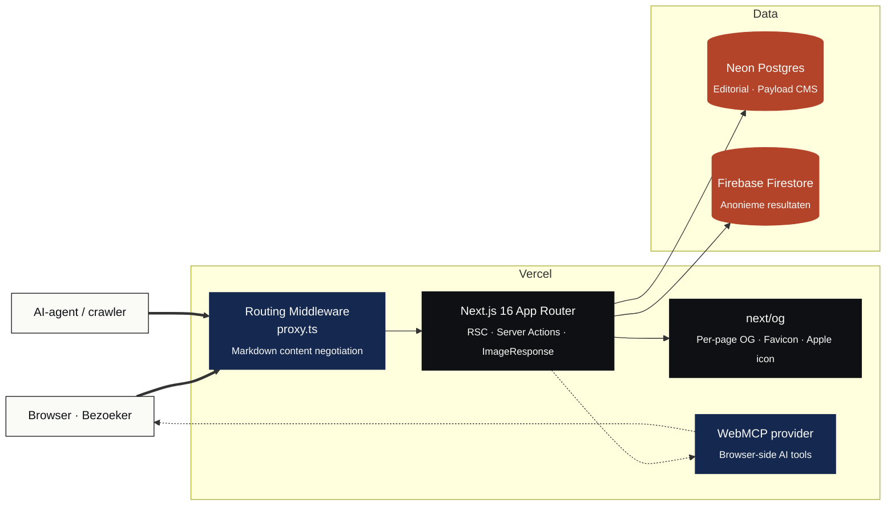

<div align="center">


<a href="https://politiekprofiel.nl">
  
</a>

<br />

<a href="https://politiekprofiel.nl"></a>
<a href="https://nextjs.org"></a>
<a href="https://www.typescriptlang.org"></a>
<a href="https://tailwindcss.com"></a>
<a href="https://payloadcms.com"></a>
<a href="LICENSE"></a>

<br /><br />


</div>

<br />

> Politieke profielen meten op één links-rechts-as is een karikatuur.
> PolitiekProfiel meet op vijf onafhankelijke dimensies, zeven beleidsthema's, paradox-detectie en confidence-scoring, met gebalanceerde stellingen en transparante scoring.
> Geen scorelijst voor partijen, geen reclame, geen tracking, geen runtime AI. Wel rustige uitleg, AI-gegenereerde duiding vooraf, en herkenbare vergelijking met politici, landen en partijen in Nederland, Europa en de Verenigde Staten.

<br />

## Inhoud

<table>
<tr>
<td valign="top" width="50%">

**Project**
- [Over PolitiekProfiel](#over-politiekprofiel)
- [Vijf dimensies](#vijf-dimensies)
- [Zeven thema's](#zeven-themas)
- [Adaptieve quiz](#adaptieve-quiz)
- [Scoring](#scoring)
- [AI-content pipeline](#ai-content-pipeline)
- [Architectuur](#architectuur)
- [Tech stack](#tech-stack)

</td>
<td valign="top" width="50%">

**Developer**
- [Snel beginnen](#snel-beginnen)
- [Scripts](#scripts)
- [Projectstructuur](#projectstructuur)
- [Routes](#routes)
- [Datamodel](#datamodel)

</td>
</tr>
<tr>
<td valign="top">

**Platform**
- [Agent discovery](#agent-discovery--seo)
- [API & WebMCP](#api--webmcp)
- [Privacy & ethiek](#privacy--ethiek)

</td>
<td valign="top">

**Deploy**
- [Productie deployen](#productie-deployen)
- [Environment variabelen](#environment-variabelen)
- [Bijdragen](#bijdragen)

</td>
</tr>
</table>

<br />

## Over PolitiekProfiel

PolitiekProfiel is een Nederlandstalig politiek kompas dat probeert te doen wat de meeste tools niet doen: politieke houding meten op meerdere onafhankelijke dimensies, zonder de gebruiker in een hokje te duwen.

De site draait op vijf principes:

<table>
<tr>
<td valign="top" width="20%" align="center">

**Onafhankelijk**

Geen partij, geen agenda. Stellingen zijn gebalanceerd over linker- en rechterperspectief.

</td>
<td valign="top" width="20%" align="center">

**Genuanceerd**

Vijf onafhankelijke dimensies, geen één-as. Schaal `−100` tot `+100`. Geen score voor partijen.

</td>
<td valign="top" width="20%" align="center">

**Transparant**

Methodiek, weging en scoring zijn gedocumenteerd. Code is leesbaar en getest.

</td>
<td valign="top" width="20%" align="center">

**Privé**

Geen account, geen tracking, geen marketing-cookies. Anonieme opslag onder de AVG.

</td>
<td valign="top" width="20%" align="center">

**Toegankelijk**

Editorial design, snelle laadtijd, screenreader-vriendelijk. Werkt zonder JavaScript voor lezen.

</td>
</tr>
</table>

<br />

<details>
<summary><b>Wat het wel is, en wat het niet is</b></summary>

| Wel | Niet |
| --- | --- |
| Een gestructureerd profiel op vijf dimensies | Een stemwijzer die partijen rangschikt |
| Een rustige, editorial omgeving om over politiek na te denken | Een polariseringsmachine of clickbait-quiz |
| Vergelijking met ideologieën, politici en landen | Een persoonlijkheidstest of een spel |
| Open over methodiek en scoring | Een black box met toevallige uitkomsten |
| Anoniem deelbare resultaten | Een tool die je gegevens verzamelt of verkoopt |

</details>

<br />

## Vijf dimensies

Iedere dimensie is onafhankelijk gescoord op `−100` tot `+100`. Geen enkele dimensie domineert de andere; je kunt economisch links én cultureel conservatief zijn, of juist economisch rechts én libertair op burgerrechten.

<table>
<thead>
<tr>
<th width="22%">Dimensie</th>
<th>Wat het meet</th>
<th width="14%">−100</th>
<th width="14%">+100</th>
</tr>
</thead>
<tbody>
<tr>
<td><b>Economisch</b><br /><sub>economic</sub></td>
<td>Belasting, regulering, herverdeling, sociale zekerheid.</td>
<td><sub>Vrije markt</sub></td>
<td><sub>Sterke staat</sub></td>
</tr>
<tr>
<td><b>Sociaal-cultureel</b><br /><sub>social</sub></td>
<td>Traditie versus openheid, identiteit en culturele verandering.</td>
<td><sub>Conservatief</sub></td>
<td><sub>Progressief</sub></td>
</tr>
<tr>
<td><b>Burgerrechten</b><br /><sub>civil</sub></td>
<td>Persoonlijke vrijheid, privacy, verhouding tot het strafrecht.</td>
<td><sub>Autoritair</sub></td>
<td><sub>Libertair</sub></td>
</tr>
<tr>
<td><b>Bestuur</b><br /><sub>governance</sub></td>
<td>Soevereiniteit, EU-integratie, internationale samenwerking.</td>
<td><sub>Nationaal</sub></td>
<td><sub>Internationaal</sub></td>
</tr>
<tr>
<td><b>Systeemvertrouwen</b><br /><sub>trust</sub></td>
<td>Vertrouwen in media, wetenschap, rechtspraak en democratie.</td>
<td><sub>Wantrouwen</sub></td>
<td><sub>Vertrouwen</sub></td>
</tr>
</tbody>
</table>

> Volledige uitleg, bronnen en aannames: [`/methodiek`](https://politiekprofiel.nl/methodiek)

<br />

<a id="zeven-themas"></a>
## Zeven thema's

Naast de vijf dimensies krijgen bezoekers vanaf v2 een score per **beleidsthema**, op dezelfde `−100..+100` schaal maar dan alleen over stellingen die het thema raken.

| Thema | -100 | +100 |
| --- | --- | --- |
| Klimaat & milieu | Behoudend | Ambitieus |
| Zorg & welzijn | Markt & eigen kracht | Publieke zorg |
| Migratie & integratie | Restrictief | Open |
| Economie & belastingen | Lasten omlaag | Herverdelen |
| EU & internationaal | Soeverein | Geïntegreerd |
| Democratie & instituties | Vernieuwen | Versterken |
| Wonen & ruimte | Markt & bouwen | Publiek sturen |

Bovenop de dimensie- en thema-scores worden ook **paradoxen** (interne tegenstrijdigheden) gedetecteerd en wordt per dimensie een **confidence-score** (0-100) berekend op basis van dekking, sterkte en consistentie van je antwoorden.

<br />

<a id="adaptieve-quiz"></a>
## Adaptieve quiz

Iedere quiz-sessie krijgt een eigen vragenset: niet iedereen ziet dezelfde stellingen. Het verloop:

1. **Broad calibration** — eerste 10 vragen, 2 per dimensie, geseed-random uit een breed kalibratie-pool.
2. **Refinement** — daarna kiest de engine vragen die dimensies aanscherpen waar je score nog rond nul ligt, en thema's afdekken die nog onderbelicht zijn.
3. **Consistency checks** — laatste batches bevatten vragen die mogelijk een paradox onthullen.

Per tier hard geplafonneerd op `quick=30`, `standard=50`, `extended=80`. Antwoorden worden lokaal in `localStorage` gepersisteerd, inclusief de tot dan toe getoonde vragenlijst, zodat een refresh de sessie precies voortzet. De oude (statische) flow blijft beschikbaar achter de feature-flag `NEXT_PUBLIC_ADAPTIVE_QUIZ`.

Implementatie: [`src/lib/adaptive.ts`](src/lib/adaptive.ts), API: [`/api/quiz/next`](src/app/api/quiz/next/route.ts), client: [`src/components/QuizEngine.tsx`](src/components/QuizEngine.tsx).

<br />

## Scoring

De scoring-engine is bewust simpel en transparant. Per dimensie:

```ts
raw       = Σ ( direction × antwoordwaarde × gewicht )    // over beantwoorde vragen
maxAbs    = Σ ( 2 × gewicht )                             // maximaal mogelijke uitslag
score     = round( raw / maxAbs × 100 )                   // genormaliseerd naar [-100, +100]
```

Antwoordwaarden lopen van `−2` (volledig oneens) via `0` (neutraal) tot `+2` (volledig eens). Een vraag heeft een `direction` (`+1` of `−1`) zodat positief geformuleerde en negatief geformuleerde stellingen elkaar opheffen. Vragen kunnen een `weight` hebben voor extra invloed.

**Matching met ideologieën, politici en landen** gebeurt via Euclidische afstand in de vijfdimensionale ruimte:

```ts
distance(a, b)    = √ Σ (aᵢ − bᵢ)²       // i ∈ { economic, social, civil, governance, trust }
similarity(a, b)  = 1 − distance / maxDistance     // → 0..100 %
```

Volledige implementatie: [`src/lib/scoring.ts`](src/lib/scoring.ts) — gedekt door [`src/lib/scoring.test.ts`](src/lib/scoring.test.ts) (Vitest).

Aanvullende scoring-modules:

- [`src/lib/themes.ts`](src/lib/themes.ts) — theme-scoring per beleidsthema (zelfde formule, alleen over thema-stellingen).
- [`src/lib/paradox.ts`](src/lib/paradox.ts) — detectie van interne tegenstrijdigheden binnen of tussen dimensies en thema's.
- [`src/lib/confidence.ts`](src/lib/confidence.ts) — vertrouwen per dimensie op basis van dekking (35%), sterkte (40%) en consistentie (25%).

<br />

<a id="ai-content-pipeline"></a>
## AI-content pipeline

PolitiekProfiel gebruikt AI **alleen build-time** voor het genereren van educatieve duiding. Geen runtime AI-calls, nooit met jouw data.

Per slot wordt content gegenereerd en opgeslagen in de `aiContent` Payload-collectie:

| Slot | Aantal | Inhoud |
| --- | --- | --- |
| `ideology:<slug>:essay` | 16 | 600-800 woorden over de stroming |
| `ideology:<slug>:reading` | 16 | 5-8 leesvoer-aanbevelingen |
| `ideology:<slug>:arguments-for` | 16 | 3-4 sterkste argumenten |
| `ideology:<slug>:arguments-against` | 16 | 3-4 respectvolle tegen-argumenten |
| `dimension:<id>:bucket:<bucket>` | 25 | wat een score op die as betekent |
| `ideology:<slug>:theme:<theme>` | 112 | hoe deze ideologie over dit thema denkt |
| `paradox:<type>` | 8 | uitleg over een interne spanning |

Totaal ~210 slots. Volledig idempotent (slug-based upsert). Audit-trail per slot bewaart prompt, model, datum en `humanEdited`-flag.

```bash
OPENAI_API_KEY="sk-..." pnpm generate:ai-content
```

Implementatie: [`src/scripts/generate-ai-content.ts`](src/scripts/generate-ai-content.ts). Server-side helper voor de resultaatpagina: [`src/lib/ai-content.ts`](src/lib/ai-content.ts). Publieke transparantie: [`/ai-transparantie`](https://politiekprofiel.nl/ai-transparantie).

<br />

## Architectuur



Het ontwerp scheidt drie zorgen:

- **Editorial content** — stellingen, ideologieën, politici en landen worden beheerd in Payload CMS op Neon Postgres. Dit is wat redacteuren bewerken.
- **Resultaten** — antwoorden worden server-side gescoord en alleen de geaggregeerde dimensiescores + ideologieslug worden anoniem opgeslagen in Firestore. Geen IP, geen user-agent, geen individuele antwoorden.
- **Discovery** — de hele site is gebouwd om door zowel mensen als AI-agents gelezen te worden: OpenAPI-spec, `robots.txt` met expliciete AI-bot rules, `/.well-known/api-catalog`, markdown content negotiation en WebMCP.

<br />

## Tech stack

<table>
<tr>
<td valign="top" width="50%">

**Frontend**

<a href="https://nextjs.org"></a>
<a href="https://react.dev"></a>
<a href="https://www.typescriptlang.org"></a>
<a href="https://tailwindcss.com"></a>
<a href="https://www.radix-ui.com"></a>
<a href="https://motion.dev"></a>
<a href="https://lucide.dev"></a>

- App Router met React Server Components
- Tailwind v4 in CSS-first mode (`@theme`, geen config-bestand)
- Radix primitives voor toegankelijke dialog, select, tooltip, progress
- Motion v12 voor scroll-reveal en quiz-overgangen
- Editorial typografie: Fraunces (display) · Inter (sans) · IBM Plex Mono

</td>
<td valign="top" width="50%">

**Backend & data**

<a href="https://payloadcms.com"></a>
<a href="https://neon.tech"></a>
<a href="https://firebase.google.com"></a>
<a href="https://vercel.com"></a>
<a href="https://vitest.dev"></a>

- Payload 3 voor admin op `/admin` met Lexical rich-text editor
- Neon Postgres in productie (via Vercel Marketplace)
- SQLite lokaal als zero-config fallback (`payload-dev.db`)
- Firestore (Admin SDK) voor server-side, anonieme resultaten
- nanoid voor 10-karakter shareIDs
- sharp voor image optimization in Payload uploads
- Vitest voor de scoring-engine

</td>
</tr>
</table>

<br />

## Snel beginnen

> Vereist: **Node.js 20+** en **pnpm 9+**. Geen extra services nodig om lokaal te draaien.

```bash
git clone https://github.com/<jij>/PolitiekProfiel.git
cd PolitiekProfiel
pnpm install

cp .env.example .env.local
# Genereer een PAYLOAD_SECRET (32 bytes hex):
#   node -e "console.log(require('crypto').randomBytes(32).toString('hex'))"

pnpm seed         # zet stellingen, ideologieën, politici en landen + admin
pnpm dev          # start op http://localhost:3000
```

Eerste login op het CMS:

```
URL       http://localhost:3000/admin
Email     admin@politiekprofiel.nl
Wachtwoord ChangeMe123!
```

> Pas aan via `SEED_ADMIN_EMAIL` en `SEED_ADMIN_PASSWORD` in `.env.local` voordat je seed't.

<br />

## Scripts

| Script | Doel |
| --- | --- |
| `pnpm dev` | Next.js dev server met HMR |
| `pnpm build` | Productie build (Turbopack) |
| `pnpm start` | Productie server |
| `pnpm lint` | ESLint over de hele codebase |
| `pnpm test` | Vitest unit tests (scoring, themes, paradox, confidence) |
| `pnpm test:watch` | Vitest in watch mode |
| `pnpm seed` | Seed alle content + admin user (questions, ideologies, politicians, parties, countries) |
| `pnpm generate:ai-content` | Genereer AI-content build-time (vereist `OPENAI_API_KEY`) |
| `pnpm payload generate:types` | Regenereer `src/payload-types.ts` |
| `pnpm payload generate:importmap` | Regenereer Payload import map |

<br />

## Projectstructuur

```
src/
├─ app/
│  ├─ (frontend)/              ─ publieke editorial site
│  │  ├─ layout.tsx            · root metadata · JSON-LD · WebMCP provider
│  │  ├─ page.tsx              · homepage met 3-tier picker
│  │  ├─ opengraph-image.tsx   · default editorial OG (1200×630)
│  │  ├─ twitter-image.tsx
│  │  ├─ docs/api/             · publieke API & agent-discovery docs
│  │  ├─ methodiek/            · uitleg vijf dimensies + scoring
│  │  ├─ privacy/              · AVG art. 9 verklaring
│  │  ├─ quiz/[tier]/          · one-question-per-screen quiz
│  │  ├─ vergelijk/            · twee profielen naast elkaar
│  │  └─ r/[id]/               · gedeeld resultaat (canonical URL)
│  │
│  ├─ (payload)/admin/         ─ Payload CMS admin
│  ├─ api/
│  │  ├─ results/              · POST · scoring + opslag
│  │  ├─ og/[id]/              · dynamische resultaat-OG
│  │  ├─ md/[slug]/            · markdown for agents
│  │  └─ docs/openapi.json/    · OpenAPI 3.1 spec
│  ├─ .well-known/api-catalog/ · RFC 9727 linkset
│  ├─ icon.tsx                 · 32×32 favicon (P in Fraunces serif)
│  ├─ apple-icon.tsx           · 180×180 apple touch icon
│  ├─ manifest.ts              · PWA manifest
│  ├─ robots.txt               · open opt-in (zoek + AI), per-bot rules
│  └─ sitemap.ts
│
├─ collections/                ─ Payload schema (Postgres)
│  ├─ Questions.ts · Ideologies.ts · Politicians.ts
│  ├─ Countries.ts · Results.ts · Users.ts
│
├─ components/
│  ├─ QuizEngine.tsx           · client quiz state · localStorage
│  ├─ ScatterPlot.tsx · LiveAxes.tsx · DimensionBar.tsx
│  ├─ ShareBlock.tsx · CompareLookup.tsx · RankedList.tsx
│  ├─ SiteHeader · SiteFooter · ConsentBanner
│  └─ WebMcpProvider.tsx       · navigator.modelContext.registerTool()
│
├─ lib/
│  ├─ scoring.ts (+ test)      · de scoring engine
│  ├─ dimensions.ts            · de vijf dimensies en tiers
│  ├─ quiz-data.ts · result-data.ts · results-store.ts
│  ├─ firebase-admin.ts · payload.ts
│  └─ og-template.tsx          · gedeelde OG image renderer
│
├─ content/markdown/           · /home, /methodiek, /privacy in MD
├─ scripts/seed.ts             · idempotente seeder
├─ proxy.ts                    · markdown content negotiation
└─ payload.config.ts
```

<br />

## Routes

| Pad | Type | Doel |
| --- | --- | --- |
| `/` | RSC | Homepage met manifesto + tier-picker |
| `/quiz/[tier]` | Client | Adaptieve quiz: `quick` (30) · `standard` (50) · `extended` (80) |
| `/r/[id]` | RSC | Resultaatpagina v2: 9 secties (profiel, dimensies, thema's, standpunten, paradoxen, partijen, politici, landen, delen) |
| `/vergelijk?a=&b=` | RSC | Twee profielen naast elkaar |
| `/methodiek` | RSC | Uitleg vijf dimensies, thema's, adaptief, scoring, beperkingen |
| `/privacy` | RSC | AVG-verklaring |
| `/ai-transparantie` | RSC | Wat AI doet, wat AI niet doet, audit-trail |
| `/docs/api` | RSC | Publieke API & agent-discovery docs |
| `/admin/**` | Payload | Editorial CMS |
| `/api/results` | POST | Validatie · scoring · Firestore-write |
| `/api/quiz/next` | POST | Volgende adaptieve vragen-batch |
| `/api/og/[id]` | GET · `next/og` | Dynamische 1200×630 share-image per resultaat |
| `/api/md/[slug]` | GET | Markdown voor `home`, `methodiek`, `privacy`, `ai-transparantie` |
| `/api/docs/openapi.json` | GET | OpenAPI 3.1 spec |
| `/.well-known/api-catalog` | GET | `application/linkset+json` (RFC 9727) |
| `/sitemap.xml` | GET | Genereerd via `app/sitemap.ts` |
| `/robots.txt` | static | Open opt-in voor zoek + AI; expliciete rules voor 18 AI-bots |
| `/manifest.webmanifest` | GET | PWA manifest |
| `/icon` `/apple-icon` `/favicon.ico` | GET | Dynamisch gerenderd via `next/og` |

<br />

## Datamodel

### Payload (Postgres / SQLite)

<table>
<tr><th>Collectie</th><th>Velden</th></tr>
<tr><td><code>questions</code></td><td>stelling · dimensie · richting (+/−) · gewicht · tiers · <strong>themes · depth · discriminator · derivedStance</strong> · info-blok (context, voor/tegen, bronnen)</td></tr>
<tr><td><code>ideologies</code></td><td>naam · slug · korte + volledige beschrijving · spectrum-positie · vector (5 dim) · voorbeelden</td></tr>
<tr><td><code>politicians</code></td><td>naam · rol · land · partij · bio · vector · <strong>ideologySlugs</strong> · bronnen · internationaal-flag</td></tr>
<tr><td><code>countries</code></td><td>naam · ISO-2 · beschrijving · vector · bronnen</td></tr>
<tr><td><code>parties</code></td><td><strong>nieuw</strong> · naam · afkorting · slug · regio (NL/EU/US) · regionType · beschrijving · ideologySlugs · vector · founded · leader · websiteUrl · lastReviewed · bronnen</td></tr>
<tr><td><code>aiContent</code></td><td><strong>nieuw</strong> · slug · kind · title · body (Lexical) · items · model · generatedAt · prompt · humanEdited</td></tr>
<tr><td><code>users</code></td><td>Payload auth-accounts (admins)</td></tr>
<tr><td><code>results</code></td><td>fallback voor lokaal als Firestore niet beschikbaar is · ondersteunt themeScores, confidence, paradoxes, answers</td></tr>
</table>

### Firestore (productie)

```ts
results/{shareId}
  ├─ tier             "quick" | "standard" | "extended"
  ├─ ideologySlug     string                                            // best-match
  ├─ dimensions       { economic, social, civil, governance, trust }    // -100..+100
  ├─ themeScores      { klimaat, zorg, migratie, economie, eu, democratie, wonen }  // optioneel · -100..+100
  ├─ confidence       { economic, social, civil, governance, trust }    // optioneel · 0..100
  ├─ paradoxes        Array<{ dimension?, theme?, type, severity, description?, exampleQuestionIds }>
  ├─ answers          Array<{ questionId, value }>                      // anoniem · voor stance-extractie
  ├─ answeredCount    number
  ├─ skippedCount     number
  ├─ totalQuestions   number
  └─ createdAt        FieldValue.serverTimestamp()
```

> Public-read · geen client writes. Schrijven gebeurt server-side via `firebase-admin` in `/api/results`. Resultaten bevatten geen IP, geen user-agent, geen vrije tekst. `answers` is een anonieme lijst (vraag-ID + numerieke waarde) die uitsluitend dient om je standpunten op de resultaatpagina te kunnen tonen.

<br />

## Agent discovery & SEO

PolitiekProfiel is gebouwd om door zowel mensen als AI-agents leesbaar te zijn. De volgende standaarden zijn geïmplementeerd:

<details>
<summary><b>robots.txt — open opt-in voor zoek én AI</b></summary>

Open beleid: zoekmachines, AI-search en AI-training mogen de site indexeren. Specifieke regels voor 18 bekende AI-crawlers (GPTBot, OAI-SearchBot, Claude-Web, PerplexityBot, etc.) zodat strengere defaults nergens worden afgedwongen. Alleen `/admin/` en `/api/` zijn afgeschermd.

```
User-agent: *
Allow: /
Disallow: /admin/
Disallow: /api/
Sitemap: https://politiekprofiel.nl/sitemap.xml
```

</details>

<details>
<summary><b>sitemap.xml</b></summary>

Programmatisch gegenereerd via `app/sitemap.ts`. Bevat de homepage, alle drie quiz-tiers, `/vergelijk`, `/methodiek`, `/privacy` en `/docs/api`.

</details>

<details>
<summary><b>Link headers (RFC 8288)</b></summary>

De homepage stuurt agent-discovery-headers mee:

```
Link: </.well-known/api-catalog>; rel="api-catalog"; type="application/linkset+json",
      </api/docs/openapi.json>;   rel="service-desc";  type="application/openapi+json",
      </docs/api>;                rel="service-doc";   type="text/html",
      </sitemap.xml>;             rel="sitemap";       type="application/xml",
      </methodiek>;               rel="describedby";   type="text/html"
Vary: Accept
```

</details>

<details>
<summary><b>API catalog (RFC 9727)</b></summary>

`/.well-known/api-catalog` levert een `application/linkset+json` document dat naar de OpenAPI-spec en HTML-docs wijst. Hierdoor kunnen agents automatisch ontdekken welke API's de site aanbiedt.

</details>

<details>
<summary><b>OpenAPI 3.1 spec</b></summary>

`/api/docs/openapi.json` documenteert het `/api/results` POST-endpoint met volledige request/response schema's, voorbeelden en error-types.

</details>

<details>
<summary><b>Markdown for Agents</b></summary>

Content negotiation via `proxy.ts`: stuur `Accept: text/markdown` mee bij `/`, `/methodiek` of `/privacy` en je krijgt een schone Markdown-versie van de pagina (geen HTML-ruis, geen scripts). Q-value parsing volgt de RFC 7231 specificatie.

```bash
curl -H "Accept: text/markdown" https://politiekprofiel.nl/methodiek
```

</details>

<details>
<summary><b>WebMCP browser-tools</b></summary>

Bij elke pagina-load registreert `WebMcpProvider` drie tools via `navigator.modelContext.registerTool()` (met fallback naar `provideContext`):

| Tool | Doel |
| --- | --- |
| `start_quiz` | Start een quiz op een gekozen tier |
| `open_compare` | Vergelijk twee resultaat-IDs |
| `open_result` | Open een specifieke gedeelde uitkomst |

Browser-side AI-agents kunnen hiermee de site bedienen zonder eigen web-scraping.

</details>

<details>
<summary><b>OpenGraph & favicons</b></summary>

Per pagina een editorial 1200×630 share-image gegenereerd via `next/og`:

| Pagina | Aanpak |
| --- | --- |
| `/` | Manifesto + meta-grid (Dimensies · Tijdsduur · Account · Tracking) |
| `/methodiek` | Schaal · Stellingen · Bias |
| `/privacy` | Cookies · Account · Wet · Opslag |
| `/docs/api` | Spec · Catalog · Markdown · Browser-AI |
| `/r/[id]` | Dynamisch · jouw vijf dimensies + ideologie-naam |

Plus PWA manifest (light/dark theme color), 32×32 favicon en 180×180 Apple touch icon, beide met de `P` in Fraunces serif op ink + terra accent.

</details>

<br />

## API & WebMCP

### Quiz indienen

```http
POST /api/results
Content-Type: application/json

{
  "tier": "standard",
  "answers": [
    { "id": 1, "value": 2 },
    { "id": 2, "value": -1 },
    { "id": 3, "value": null }
  ]
}
```

Response:

```json
{ "id": "K8sZ2y0xQp" }
```

> De server valideert vraag-IDs, scoort de antwoorden, bepaalt de best-matching ideologie en schrijft het anonieme resultaat naar Firestore. Zie [`/docs/api`](https://politiekprofiel.nl/docs/api) of [`/api/docs/openapi.json`](https://politiekprofiel.nl/api/docs/openapi.json) voor het volledige contract.

### WebMCP-tool aanroepen (browser-side)

```js
// Geregistreerd door <WebMcpProvider /> bij elke page load
await navigator.modelContext.callTool('start_quiz', { tier: 'standard' });
await navigator.modelContext.callTool('open_compare', { a: 'abc', b: 'xyz' });
await navigator.modelContext.callTool('open_result', { id: 'K8sZ2y0xQp' });
```

<br />

## Privacy & ethiek

> **Politieke voorkeur is een bijzondere persoonscategorie onder AVG art. 9.** Daarom zijn de keuzes hier expliciet anders dan bij een gewone web-app.

| Wat we niet doen | Hoe |
| --- | --- |
| Geen tracking | Geen Google Analytics, geen Plausible, geen pixels |
| Geen account | Geen registratie, geen login, geen profielen |
| Geen marketing-cookies | Cookieconsent-banner is informatief; niets te accepteren |
| Geen IP-opslag | Niet gelogd bij `/api/results` |
| Geen user-agent | Niet gelogd bij `/api/results` |
| Geen individuele antwoorden | Alleen de geaggregeerde dimensiescores worden bewaard |

| Wat we wel doen | Hoe |
| --- | --- |
| Anoniem deelbaar resultaat | `nanoid(10)` in `/r/[id]`, public-read in Firestore |
| Lokale voortgang | `localStorage` in de browser, niet ge-sync naar de server |
| Right-to-erasure | Laat een resultaat-ID verwijderen via privacy@politiekprofiel.nl (zie `/privacy`) |
| Open methodiek | Volledige uitleg op `/methodiek`, code in `src/lib/scoring.ts` |

<br />

## Productie deployen

> Aanbevolen: **Vercel** met Fluid Compute. Werkt met andere Node-hosts mits `firebase-admin` Node.js runtime kan starten.

1. Project linken aan Vercel: `vercel link`
2. **Neon Postgres** toevoegen via Vercel Marketplace → vult `DATABASE_URL` automatisch
3. **Firebase project** aanmaken op [console.firebase.google.com](https://console.firebase.google.com), Firestore in productie-mode, en een service-account aanmaken
4. Environment variabelen zetten (zie tabel hieronder)
5. Eerste deploy:

```bash
vercel deploy --prod
```

6. **Seed de productie-DB** met content (eenmalig of na content-update):

```bash
DATABASE_URL="postgresql://..." pnpm seed
```

> Resultaten staan in Firestore en worden niet door `pnpm seed` aangeraakt.

### Environment variabelen

| Variabele | Wanneer nodig | Voorbeeld |
| --- | --- | --- |
| `PAYLOAD_SECRET` | altijd | 32-byte hex |
| `DATABASE_URL` | productie | `postgresql://user:pw@host/db?sslmode=require` |
| `NEXT_PUBLIC_SITE_URL` | productie | `https://politiekprofiel.nl` |
| `FIREBASE_PROJECT_ID` | productie | `politiekprofiel-app` |
| `FIREBASE_CLIENT_EMAIL` | productie | service-account email |
| `FIREBASE_PRIVATE_KEY` | productie | met letterlijke `\n` voor newlines |
| `OPENAI_API_KEY` | bij `generate:ai-content` | `sk-...` · alleen build-time, nooit runtime |
| `OPENAI_MODEL` | optioneel | overschrijft default model voor AI-content |
| `NEXT_PUBLIC_ADAPTIVE_QUIZ` | optioneel | `"true"` voor adaptief, `"false"` voor de oude statische flow |
| `SEED_ADMIN_EMAIL` | optioneel | overschrijft default seed-admin |
| `SEED_ADMIN_PASSWORD` | optioneel | overschrijft default seed-wachtwoord |

> Lokaal: laat `DATABASE_URL` leeg om SQLite te gebruiken. Zonder Firebase-vars valt de `/api/results`-endpoint terug op de Payload `results`-collectie.

<br />

## Bijdragen

Issues en PR's zijn welkom. Houd het volgende in gedachten:

- **Stellingen** moeten gebalanceerd zijn over linker- en rechterperspectief. Zie de bestaande `Questions`-collectie als referentie.
- **Bronnen** zijn verplicht voor politici en landen — wees voorzichtig met claims over personen.
- **Tests** voor scoring-logica zijn een harde eis (`pnpm test`).
- **Geen tracking** — geen analytics-snippets, geen ad-pixels, geen marketing-cookies. Dit is een principle, geen voorkeur.
- **Editorial design** — Fraunces serif voor display, Inter voor body, IBM Plex Mono voor cijfers/labels. Geen iconenoverdaad.

<br />

## Licentie

Privé-project. Niet bedoeld voor herdistributie zonder toestemming.

<br />

<div align="center">


<sub>Gemaakt met aandacht door <a href="https://naoufalandichi.nl">Naoufal Andichi</a> · Nederland · 2026</sub>

<br />

<sub><b>politiekprofiel.nl</b> · <a href="https://politiekprofiel.nl/methodiek">methodiek</a> · <a href="https://politiekprofiel.nl/privacy">privacy</a> · <a href="https://politiekprofiel.nl/docs/api">api & agents</a></sub>

</div>
